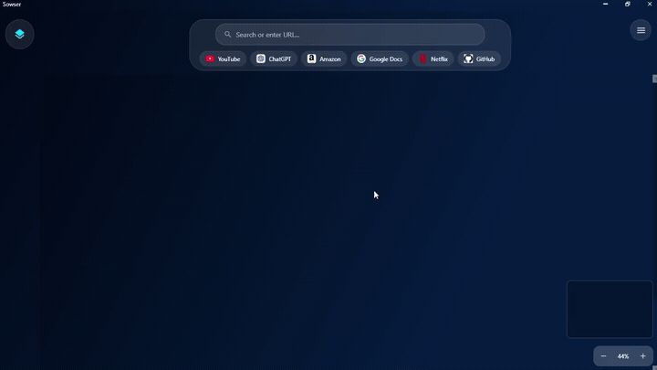

<div align="center">

# Tree-Tabs

### *Spatial browsing — your tabs live on a canvas, not in a queue.*

**A Windows desktop workspace where every site is a movable card.**  
Pan, zoom, group, and connect ideas the way you think — powered by **WPF** and **Microsoft Edge WebView2**.

<br/>

[](https://dotnet.microsoft.com/)
[](https://www.microsoft.com/windows)
[](https://learn.microsoft.com/dotnet/desktop/wpf/)
[](https://developer.microsoft.com/microsoft-edge/webview2/)

<br/>

</div>

---

## Demo

GitHub’s README **does not show an HTML `<video>` player** for files stored in the repo (those tags are removed for security). The preview below is an **animated GIF** so the walkthrough plays **inline on this page**; for full quality and audio, open **`demo.mp4`**.



**Full demo (with audio):** [demo.mp4](./demo.mp4) — click to open or download from the file view.

<details>
<summary>Advanced: inline MP4 on GitHub only</summary>

To get GitHub’s own video player in the README, edit this file on **github.com**, drag **`demo.mp4`** into the editor, and keep the URL GitHub inserts (it starts with `https://user-images.githubusercontent.com/` or `https://github.com/user-attachments/assets/`). That URL renders as a player; repo file URLs do not.

</details>

---

## Deep Guide

This README is meant to explain Sowser at three levels: what the app is, how people use it, and how the codebase is organized. Sowser is not a normal tab manager. It is a native Windows workspace where browsing becomes spatial: pages are live objects on a canvas, not entries hidden behind a tab strip.

### Product Idea

Sowser is designed for moments where context matters:

- Researching a topic across many sources.
- Comparing products, docs, papers, dashboards, or search results.
- Planning a project with references, notes, and related links visible together.
- Debugging across issue trackers, documentation, logs, and code search.
- Learning a subject by arranging sources into clusters.
- Keeping a visual trail of how one page led to another.

The core bet is that people remember space well. If a user places documentation on the left, videos on the right, notes below, and related sources in a colored group, that layout becomes part of the work. Sowser tries to preserve that mental map.

---

## Core Concepts

| Concept | Meaning |
|:--|:--|
| **Canvas** | The main spatial surface. Browser cards, image clips, notes, and connections live here. |
| **Browser card** | A draggable, resizable live browser surface backed by Microsoft Edge WebView2. |
| **Workspace** | The saved state of the canvas: cards, positions, sizes, groups, connections, bookmarks, zoom, viewport, and theme. |
| **Group** | A named color cluster used to organize related cards. |
| **Connection** | A visual relationship between two cards, drawn as a line on the canvas. |
| **Profile** | A WebView2 storage context, useful for separating sessions or identities. |
| **Read later** | A persistent local list of links the user wants to return to. |
| **Image clip** | A captured preview of a card placed onto the canvas as a lightweight visual reference. |
| **AI Smart Organize** | A Gemma-powered feature that groups open cards by topic and lays them out into columns. |

---

## How The App Works

At runtime, `MainWindow` owns the workspace. It manages the canvas, creates cards, wires events, updates connection lines, saves and loads workspaces, controls side panels, handles keyboard shortcuts, and coordinates feature services.

The canvas is WPF-based. Cards are added directly to `CardsCanvas`, and their positions are stored with `Canvas.SetLeft` and `Canvas.SetTop`. When a card moves or resizes, the app updates connection lines and recalculates the scrollable canvas size so the workspace can keep growing.

Browser content is provided by WebView2. Each `BrowserCard` wraps a WebView2 control and exposes browser state such as current URL and title. The parent window listens for card events such as navigation, close, movement, download start, link opening, group assignment, and screenshot capture.

Workspace state is serialized to JSON. A saved workspace can recreate the layout later by rebuilding cards, groups, connections, bookmarks, viewport position, zoom level, and background theme.

---

## Main User Workflows

### Create A Spatial Browsing Session

1. Open a browser card with `Ctrl+T` or the URL/search bar.
2. Search or navigate normally inside the card.
3. Drag the card to a meaningful place on the canvas.
4. Add more cards for related pages.
5. Resize important cards so they are easier to scan.
6. Use zoom and fit-all to move between detail view and overview.

### Organize A Research Layout

1. Put related pages near each other.
2. Assign groups manually, or use **AI Smart Organize**.
3. Add sticky notes beside important clusters.
4. Connect cards that have a relationship.
5. Capture screenshots as image clips when a page should become a static reference.
6. Save the workspace as a `.sowser` file.

### Recover Or Continue Work

1. Use auto-save/session restore for recent work.
2. Load a saved `.sowser` file when returning to a project.
3. Use global find to jump to a specific card by title or URL.
4. Use fit-all or the minimap if the canvas has grown large.

---

## AI Smart Organize

Sowser includes a Gemma-powered organization workflow. It is designed to work locally first with Ollama and `gemma3:4b`.

When the user clicks **AI Smart Organize**, the app:

1. Collects every open browser card title and URL.
2. Sends the list to the configured model.
3. Requests strict JSON output.
4. Parses model output into groups.
5. Creates or updates visual card groups.
6. Moves grouped cards into vertical columns.
7. Applies group colors to matching cards.
8. Leaves unmatched cards in place and clears their group color.

### Default Ollama Setup

```text
Endpoint: http://localhost:11434
Model:    gemma3:4b
```

Install Ollama, pull the model, and start the local server:

```powershell
ollama pull gemma3:4b
ollama serve
```

Then open at least two cards in Sowser and run **AI Smart Organize**.

### Gemini API Fallback

The code also supports a Gemini API fallback using:

```text
Model: gemma-3-4b-it
API:   generativelanguage.googleapis.com
```

The fallback is controlled by `GemmaSettings`. By default, local Ollama is enabled and the Gemini API key is empty.

### Failure Behavior

The AI path is intentionally defensive:

- HTTP timeout is set to 30 seconds.
- Network errors are caught.
- Malformed model output is caught.
- Markdown code fences are stripped before parsing.
- Exceptions are written to `Debug`.
- The app shows a toast instead of crashing.

---

## Architecture

| Area | Files | Responsibility |
|:--|:--|:--|
| **Application entry** | `App.xaml`, `App.xaml.cs` | Starts the WPF application and loads global resources. |
| **Main shell** | `MainWindow.xaml`, `MainWindow.xaml.cs` | Window chrome, canvas, cards, shortcuts, panels, save/load, minimap, zoom, connections. |
| **Feature pack** | `MainWindow.FeaturePack.cs` | Additional feature handlers and integrations that extend the main window. |
| **Controls** | `Controls/` | Browser cards, image clips, sticky notes, and reusable UI pieces. |
| **Models** | `Models/` | Serializable data structures for settings, cards, groups, workspaces, history, downloads, and AI settings. |
| **Services** | `Services/` | Persistence, WebView profile management, tracker blocking, bookmark IO, Gemma calls, and AI layout organization. |
| **Website** | `website/` | Static marketing/download page. This is separate from the desktop app. |

### Important Runtime Objects

| Object | Role |
|:--|:--|
| `_cards` | Dictionary of live `BrowserCard` controls by card id. |
| `_connections` | List of saved relationships between cards. |
| `_groups` | List of named color groups. |
| `_settings` | Current app settings loaded from disk. |
| `CardsCanvas` | WPF canvas that hosts live cards and clips. |
| `ConnectionsCanvas` | Overlay canvas that draws relationship lines. |
| `CanvasScrollViewer` | Scroll container for navigating the large workspace. |

---

## Data Model

### App Settings

Settings are stored through `AppSettingsStore` and include:

- Default search engine.
- Theme and canvas background.
- Auto-save enabled state.
- Auto-save interval.
- Session restore mode.
- Tracker blocking.
- Offscreen card suspension.
- Time Machine snapshot preference.
- Default browser profile.
- Read-later list.
- Custom quick links.
- Gemma settings.

Default location:

```text
%AppData%\Sowser\appsettings.json
```

### Workspace State

Workspace saves include:

- Viewport X/Y.
- Zoom level.
- Cards.
- Connections.
- Bookmarks.
- Groups.
- Background theme.

Each card state includes:

- Card id.
- X/Y position.
- Width and height.
- URL and title.
- Group id.
- Browser profile.
- Portal metadata.

### Groups

Groups are represented by `CardGroup`. They contain:

- Stable id.
- Display name.
- Hex color.
- Assigned card ids.
- AI-returned URL list when produced by Smart Organize.

---

## Build And Run

From the repository root:

```powershell
dotnet restore
dotnet build -c Release
```

Run the app from:

```text
bin\Release\net8.0-windows\Sowser.exe
```

For day-to-day development:

```powershell
dotnet build
dotnet run
```

Or open `Sowser.sln` in Visual Studio or Rider and start the **Sowser** project.

### Publish

Framework-dependent build:

```powershell
dotnet publish -c Release -r win-x64 --self-contained false -o publish\win-x64
```

Self-contained build:

```powershell
dotnet publish -c Release -r win-x64 --self-contained true -o publish\win-x64-sc
```

Distribute the full publish folder, not only the `.exe`, because WebView2/WPF apps may require native runtime files and supporting folders.

---

## Requirements

| Requirement | Details |
|:--|:--|
| **Operating system** | Windows 10 or Windows 11. |
| **Development SDK** | .NET 8 SDK. |
| **User runtime** | .NET 8 Desktop Runtime, unless using a self-contained publish. |
| **Browser runtime** | Microsoft Edge WebView2 Evergreen Runtime. |
| **Optional local AI** | Ollama with `gemma3:4b`. |

---

## Repository Layout

```text
TREE-TABS/
|-- README.md
|-- Sowser.sln
|-- Sowser.csproj
|-- App.xaml
|-- App.xaml.cs
|-- MainWindow.xaml
|-- MainWindow.xaml.cs
|-- MainWindow.FeaturePack.cs
|-- Controls/
|   |-- BrowserCard.xaml
|   |-- BrowserCard.xaml.cs
|   |-- ImageClipCard.xaml
|   |-- ImageClipCard.xaml.cs
|   |-- StickyNote.xaml
|   `-- StickyNote.xaml.cs
|-- Models/
|   |-- AppSettings.cs
|   |-- WorkspaceState.cs
|   |-- CardState.cs
|   |-- CardGroup.cs
|   |-- GemmaSettings.cs
|   `-- ...
|-- Services/
|   |-- AppSettingsStore.cs
|   |-- WebViewProfileEnvironment.cs
|   |-- TrackerBlocklist.cs
|   |-- GemmaService.cs
|   |-- GemmaOrganizeService.cs
|   `-- ...
|-- Helpers/
|-- website/
|-- publish/
|-- demo.gif
`-- demo.mp4
```

---

## Troubleshooting

| Problem | Check |
|:--|:--|
| Web pages do not render | Install or repair WebView2 Evergreen Runtime. |
| Build shows `NU1900` | NuGet vulnerability metadata could not be fetched; this is usually a network/feed warning, not a compile error. |
| AI organize fails | Make sure Ollama is running and `gemma3:4b` is pulled. |
| AI organize is slow | The first model call may load the model into memory. Try again after the first request completes. |
| Shortcuts do not fire | Focus may be inside a webpage. Click the app chrome or canvas and retry. |
| Large workspace feels heavy | Enable offscreen suspension, tracker blocking, or convert less-needed pages to image clips. |
| Loaded workspace has blank cards | The layout restored, but pages may require network access, login, or a compatible WebView2 session. |

---

## Development Notes

- Target framework: `net8.0-windows`.
- UI framework: WPF.
- Browser engine: Microsoft Edge WebView2.
- Existing packages should be preferred over new dependencies.
- Keep model classes serializable.
- Keep WPF canvas mutations on the UI thread.
- Keep feature services small and focused.
- Use `dotnet build` before submitting changes.

---

## Why Sowser?

Traditional browsers optimize for **one column of tabs**. Sowser optimizes for **space**: research layouts, comparison grids, mood boards, and deep dives where context matters. Each page is a **card** on an infinite canvas — drag, resize, zoom out for the big picture, zoom in for detail.

> *Less alt-tabbing. More seeing everything at once.*

---

## Highlights

| | |
|:---|:---|
| **Infinite canvas** | Pan (Space + drag), zoom, fit-all, themed backgrounds that flow through the whole window chrome. |
| **Live web cards** | Full Chromium rendering via WebView2 — not screenshots, real pages. |
| **Command palette** | `Ctrl+K` to jump to cards, bookmarks, or history by typing a few characters. |
| **Workspace memory** | Save and load layouts; optional auto-save; session restore modes. |
| **Read later & clips** | Queue articles for later; capture a card to an **image clip** on the canvas. |
| **Privacy-minded options** | Optional tracker blocking; per-card profiles; suspend offscreen cards to save resources. |

---

## Feature tour

<details>
<summary><strong>Canvas & navigation</strong></summary>

- **Browser cards** — create, drag, resize, connect with lines, color-coded **groups**.
- **Sticky notes** — quick annotations alongside pages.
- **Minimap** — orientation and click-to-navigate on large layouts.
- **Global find** — `Ctrl+Shift+F` filters cards by title or URL.
- **Undo** — `Ctrl+Z` for restorative actions (e.g. bringing back a closed card).
- **Focus cycling** — `Ctrl+Tab` / `Ctrl+Shift+Tab` moves focus between cards.

</details>

<details>
<summary><strong>Browser & productivity</strong></summary>

- **Bookmarks, history, downloads** — dedicated side panels (`Ctrl+B`, `Ctrl+H`, `Ctrl+J`).
- **Quick links** — configurable shortcuts in the top bar; sensible defaults out of the box.
- **Read later list** — persisted in settings; open any entry as a new card.
- **Screenshot to canvas** — capture the current card preview as a floating **image clip**.
- **Search / URL bar** — unified entry; multiple search engines supported in settings.
- **Card context menu** — read-later, capture, profile options, and more.

</details>

<details>
<summary><strong>Look & feel</strong></summary>

- **Material Design** surfaces (MaterialDesignInXAML).
- **Canvas themes** — dark, patterns, and gradients; window, caption bar, and shell stay in sync.
- **Custom window chrome** — caption controls (minimize, maximize, close) integrated with the glass aesthetic.
- **Toasts & overlays** — command palette, shortcuts help, expanded card view.

</details>

---

## Keyboard shortcuts

Press **`?`** (Shift + `/`) in the app for the full cheat sheet. Essentials:

| Shortcut | Action |
|:--|:--|
| `Ctrl+T` | New browser card |
| `Ctrl+Shift+N` | New sticky note |
| `Ctrl+K` | Command palette |
| `Ctrl+Shift+F` | Find on canvas |
| `Ctrl+Tab` | Next card focus |
| `Ctrl+Z` | Undo |
| `Ctrl+S` / `Ctrl+O` | Save / load workspace |
| `Ctrl+Plus` / `Ctrl+Minus` / `Ctrl+0` | Zoom in / out / reset |
| `Alt+M` | Toggle main menu |

**Fit all cards** — use the **fit** control next to the zoom widget on the canvas chrome (or the equivalent command from the main menu).

*Tip: If a shortcut does not fire, focus may be inside a web page — click the app chrome or canvas and try again.*

---

## Requirements

- **OS:** Windows 10 or Windows 11 (64-bit)
- **Runtime:** [.NET 8 SDK](https://dotnet.microsoft.com/download) (to build); target users need the [.NET 8 **Desktop** Runtime](https://dotnet.microsoft.com/download/dotnet/8.0) unless you ship a self-contained build
- **WebView2:** [Evergreen WebView2 Runtime](https://developer.microsoft.com/microsoft-edge/webview2/) (often already present with Edge)

---

## Build & run

```powershell
cd tree_tapsview_main
dotnet restore
dotnet build -c Release
```

Run the executable from the build output, for example:

```text
tree_tapsview_main\bin\Release\net8.0-windows\Sowser.exe
```

Or from Visual Studio / Rider: open `Sowser.sln` and start the **Sowser** project.

### Publish for sharing

**Framework-dependent** (smaller; users install .NET 8 Desktop Runtime):

```powershell
cd tree_tapsview_main
dotnet publish -c Release -r win-x64 --self-contained false -o ..\publish\win-x64
```

**Self-contained** (larger; no separate .NET install on the target PC):

```powershell
dotnet publish -c Release -r win-x64 --self-contained true -o ..\publish\win-x64-sc
```

Distribute the **entire output folder** as a ZIP (include `WebView2Loader.dll` and `runtimes` when present). WebView2-based apps are not reliably “single file only.”

---

## Landing page (Vercel)

The **Sowser app does not run on Vercel** — it is a native Windows program. The **`website/`** folder is a static **download & info** page you can host on [Vercel](https://vercel.com): set the project **root directory** to `website`, framework **Other**, no build command. Point the download button to your **GitHub Release** ZIP or Microsoft Store link.

---

## Repository layout

```text
Tree Taps/
├── README.md                 ← You are here
├── website/                  ← Static landing page for Vercel / any host
└── tree_tapsview_main/       ← WPF application (Sowser)
    ├── Sowser.sln
    ├── Sowser.csproj
    ├── MainWindow.xaml(.cs)  ← Shell, canvas, shortcuts, themes
    ├── MainWindow.FeaturePack.cs
    ├── Controls/             ← BrowserCard, ImageClipCard, …
    ├── Models/               ← Settings, cards, read-later, …
    └── Services/             ← Persistence, blocking, bookmarks IO, …
```

---

## Configuration

Settings are persisted locally (e.g. default search engine, canvas theme, auto-save interval, tracker blocking, **read later** list, custom quick links, default browser profile). Paths and formats are handled by `AppSettingsStore` — your data stays on your machine unless you sync the profile folder yourself.

---

## Roadmap ideas

- Cross-platform or web companion (would be a separate product surface)
- Cloud sync for workspaces (opt-in, encrypted)
- Extension model or user scripts
- Deeper accessibility (narrator, high-contrast themes)

---

## Contributing

Issues and pull requests are welcome. Please keep changes focused, match existing naming and patterns, and verify `dotnet build` before submitting.

---

## Acknowledgments

Built with **WPF**, **MaterialDesignInXAML**, and **WebView2**. Thanks to the teams behind .NET and the Chromium-based WebView2 runtime.

---

<div align="center">

**Sowser** — *think in space, not in tabs.*

<br/>

<sub>If this project helped you, consider starring the repo and sharing your favorite workflow.</sub>

</div>
